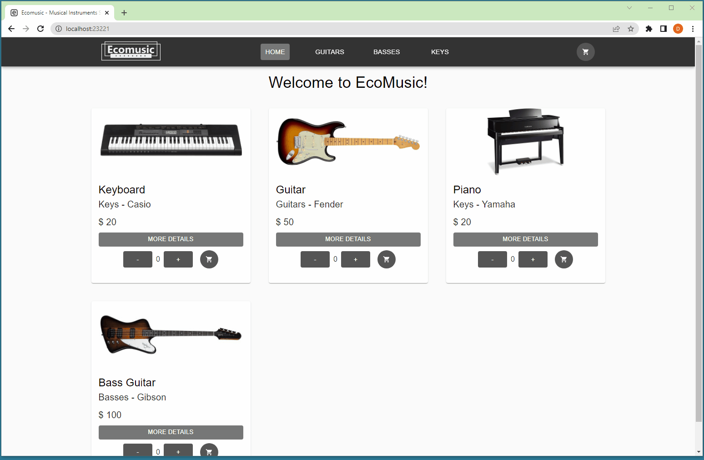

# Proyecto Ecommerce Coder House

Este proyecto es realizado como trabajo integrador del curso de React JS de Coder House. Esta aplicacion web se conecta con el backend realizado con Firebase permitiendo navegar entre los diferentes productos y categorias, ver su detalle, agregarlos al carrito y realizar una compra.

## Tecnologias

- ReactJS
- Material UI
- Firebase

## Contenido

En la version actual se encuentran las siguentes funcionalidades:

- Home
- Barra de navegacion
- Listado de productos
- Contador de productos
- Detalle de producto

## Correr el proyecto

Para correr el proyecto se debe correr la siguiente linea por terminal en la ruta donde se descargo el mismo

### `npm start`

El puerto actual es el `23221`, el cual puedo modificarse en el archivo `package.json`

## Demostracion

## URL Produccion

https://ecomusic-dagostino.vercel.app/
